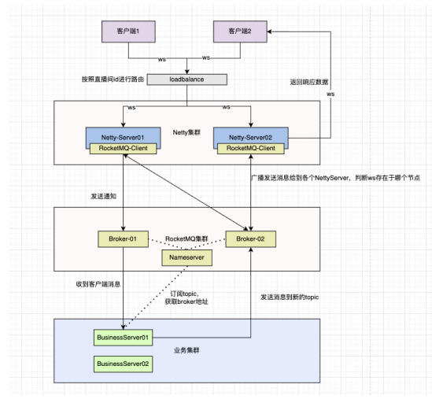
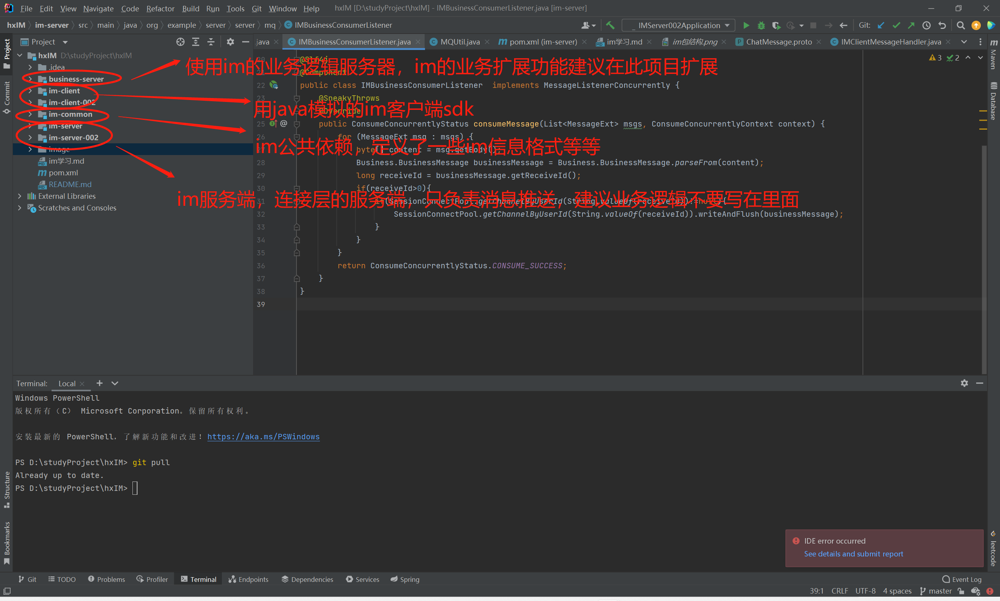

[toc]

# IM的定义

im是InstantMessaging（即时通讯、实时传讯）的缩写是IM，这是一种可以让使用者在网络上建立某种私人聊天室（chatroom）的实时通讯服务。
**先理一下概念就行，后续慢慢加深理解**

# 啥时候要用它

## 一些令人头疼的场景

目前你负责了一款新app的研发工作，目前app没有接入IM，只是通过传统的HTTP接口进行前后端的交互。

场景一：

产品最近要统计一下用户的app在线时间，方便后续做内容的改版。

你惊讶的发现，后台这边根本不能很好的统计用户的在线时间，因为所有的状态统计操作都是基于前端对于后端接口的请求之上做的逻辑，如果用户直接使用杀进程、网络异常等等方式退出app，你根本不知道用户当前是属于浏览app里的内容状态还是已退出状态。

场景二：

产品要接入一种产品的订单支付功能，需要用户支付后，立刻返回支付结果给用户。

你又发现，后台这边可以通过各种第三方的支付回调很快的得知支付结果。可是后台却不能立刻将支付结果推送给客户端，必须等客户端请求支付结果才可以得知支付状态。由于第三方的支付回调时间是不确定的，通过客户端请求支付结果来刷新支付状态也不是一种很好的方法。

场景三：

产品要实现用户与商家的简单聊天功能，及时收到相互的聊天信息。

你要哭了，当前的客户端与服务端通过HTTP的交互方式，怎么可能及时推送聊天信息呢。

**一些丑陋的解决方案：**

对于场景1，可以有着两种解决方案----

（1）客户端与后端维持心跳机制（每个一定时间请求心跳接口）。通过心跳判断客户端是否下线。

缺点：后端不能专注于业务，要用宝贵的资源维持心跳；心跳接口为HTTP格式，信息冗余严重。

（2）客户端使用钩子函数，在被关闭前通知后端。

缺点：客户端可能会有断网场景，这种情况下，不能保证后端接收到下线信息。

对于场景2，3，也可以有两种解决方案----

（1）客户端频繁短轮询。

缺点：浪费网络资源，状态更新不及时。

（2）客户端长轮询。

缺点：用户体验不好，难以约定长轮询的时间。

**推荐的解决方案----客户端与服务端接入IM服务**

（1）对于客户端来说，接入IM的sdk，就可以收到im发送的信息，根据接收到的信息做各种逻辑。不用像原来一样只有主动请求才能拿到数据。

（2）对于服务端来说，接入IM的接口，就可以通过im接收、推送信息，不用等待客户端来请求才返回结果。

## IM更多适用场景

（1）聊天：qq、微信

（2）直播：斗鱼直播、抖音

（3）实时位置共享

（4）游戏多人互动等等

几乎所有高实时性的应用场景都需要用到IM技术。

# IM实现模型与相关技术栈

## IM大致模型图

通过前面的场景我们能够发现，一个im服务，应该具有以下基本功能

（1）客户端、服务端相互实时推送信息----长连接

在此基础之上，我们还要求IM拥有以下特点

（1）高可用----任一一端下线另一端要有感知，推送要可靠

（2）支持高并发---实时通讯可能会有大量客户端同时在线

（3）低时延，高性能----实时性佳

（4）可以快速扩展，接入业务----IM也有简单的业务含义（大部分人接入IM时都是实时通信，所以IM服务会设计一套扩展性强的实时通信业务）

可以据此画一个简单的demo图，实际上大部分im都采用了模型图

**补充：这个模型图是参照工作中的IM服务画的，可能有些细节或者某些技术栈是过时了的，大家具体情况具体分析**

## 相关技术栈

（1）netty

为了追求服务的高性能，客户端与im服务都是采用rpc通信。而rpc通信中，使用netty来编写通信框架无疑是最高性能的（很多rpc框架底层都是使用netty写的，比如dubbo）

**??? 为什么选择netty**

（2）消息队列

采用消息队列与业务端交互，减少业务耦合性，确保不会出现消息丢失等等情况。

（3）分布式相关知识点

因为要和数以万计的客户端维护长连接，不可避免得需要分布式集群相关知识点。

# 和我一起从零开始开发一个IM服务

# IM连接层

首先搭建一个稳定的连接（连接层属于基础架构，要尽量做到简洁稳定，少做业务逻辑）。

我们可以根据需求一步一步搭建：

## 目标一：客户端与服务端搭建一个长连接，实现心跳机制

大致逻辑：
（1）服务器开启长连接监听，绑定idleHandler做心跳判断即可。
（2）客户端请求连接，添加心跳触发器即可。

具体代码见客户端以及服务端的启动方法

测试演示：

（1）模拟客户端初始化IM连接过程

（2）测试心跳机制

## 目标二：定义消息格式，实现客户端与服务端的通信

大致逻辑：

（1）先在common定义消息类型。先定义一个基本信息类型BaseMessage，再在这个类之上扩展出上线信息OnlineMessage，聊天信息ChatMessage等等。
（2）在客户端的接口封装好，所有发送消息都是BaseMessage格式。
（3）在服务端的handler写一个公共消息处理方法，再根据消息类型不同转发到不同的handler。

具体代码见common里的消息格式，客户端的api以及服务端的业务处理handler

测试演示：

（1）客户端给服务端发消息

（2）服务端给客户端发消息

## 目标三：实现不同用户连接同一台服务器的通信。

大致逻辑：

（1）在服务端构建一个连接内存池，存储userId以及channel的对应关系。

（2）收到用户发给其他用户的聊天信息时，检查其他用户的channel，如果存在就通过该channel推送给其他用户

具体代码见服务端的消息handler

测试演示：

（1）客户端a给客户端b发消息

       
## 目标四：实现不同用户连接不同服务器的聊天功能。

大致逻辑

对于服务端：

（1）服务启动时，注册节点信息到redis，下线时去除。

（2）每次用户上线时存储用户-本节点到redis中。用户发送聊天信息给其他在线用户时，服务器先在本地内存寻找其他用户的channel，如果
存在直接通过改channel推送即可。否则通过mq投递到其他服务器。

（3）每个服务端要订阅的mq消息，通过mq拿到属于自己的消息进行推送

问题：是否可以优化为先查询用户处于哪台服务器上，再直接请求那台服务器，而不是这种群发的形式？
       
## 目标五：保证消息不丢失

由于消息在每一个阶段都可能丢失，如果需要确保消息不丢失，必须引入消息的确认机制。超出一定时间后仍然没有确认的消息需要进行重发。

注意：引入确认机制后，要注意逻辑的防重处理。

# IM业务层

之后可以考虑搭建一个通用的业务层，方便后续扩展。我们可以参照微信，来设计

表的设计

（1）用户联系人表（记录用户联系人，维护聊天联系人列表，消息未读数）注意：每个用户都得维护自己的记录，两个人的会话应该有两条对应记录。

（2）聊天消息表（记录聊天消息，要区分已读消息和未读消息和离线消息，要做分表处理）

（3）会话表（记录会话信息，例如私聊，群组）

## 目标一：维护用户的关系以及会话消息

增加一张好友申请表，好友关系表。

（1）用户1向用户2发送一条好友申请记录。
（2）用户2在查看申请列表时发现存在好友1的申请。
（3）用户2同意申请，生成好友关系记录，生成两条联系人记录，给用户1发送"你好"聊天消息。

## 目标二：离线消息的设计

聊天信息表增加消息类型字段或者增加一张离线消息表。

（1）连接层转发消息时，发现用户不在线。立刻通过mq转发到业务端。
（2）业务端收到离线消息，储存起来。
（3）用户下次上线时，推送上次的离线消息（建议使用推拉结合的方式）。

## 扩展目标三：消息未读

功能点一：消息的未读，已读状态（这样消息的发送者可以看到他发出的消息是否已读）

每个消息维护一个已读状态，被读时更新状态即可。

问题：

（1）因为一个会话对应两个用户，由于每个用户都有查看消息的已读未读状态，是否每条消息要存两次？

（2）目前我们的消息都是按照时间展示的，读的顺序也是按照时间来读，我们在会话存储一个已读消息id即可？

功能点二：未读消息数（包含每个会话未读消息数和总未读数）

每个用户会话维护一个该会话的未读消息数，每个用户维护一个总未读数。当用户收到消息时，会话与总未读数增加1。

问题：会话与总未读数不一致？

## 扩展目标四：群聊相关

在用户联系人里面加上群联系人id，在会话表中增加群组关系记录，记录群组里的用户id。

（1）用户向群会话发送消息。

（2）连接层转发到在线的群员，把消息推动给每一个群员

难点一：如何同时给群组所有人同时推送信息？（是和私聊那种先查询用户状态再精准推送？）

难点二：群组的离线消息如何保存（每个群员的未读消息都是不同的，如何维护）？

